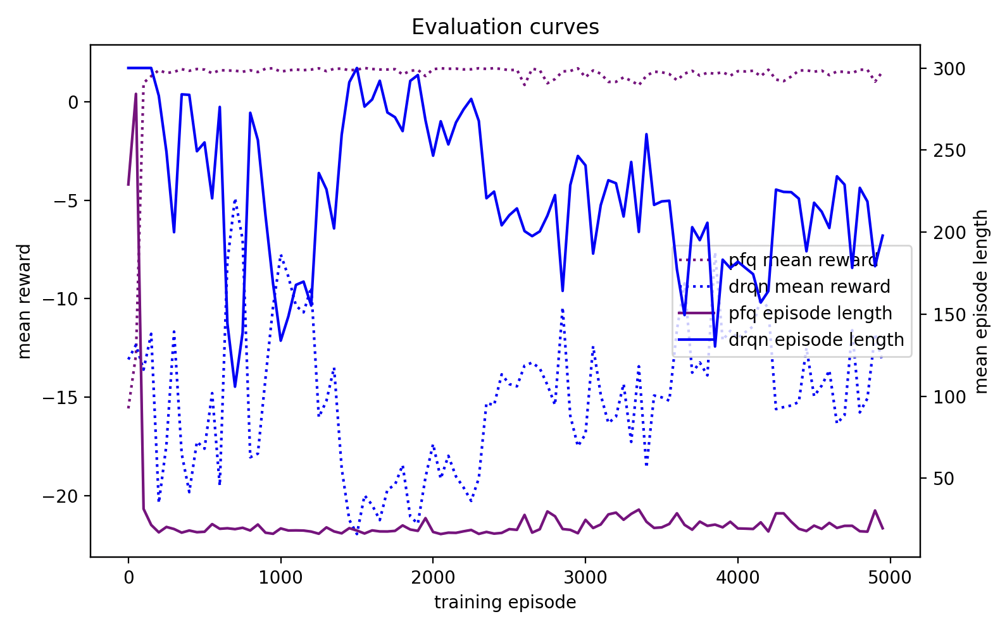

# Bayesian RL for Autonomous Navigation in POMDPs

This project tackles navigation under uncertainty, such as Gaussian sensor noise, symmetrical maze layouts and partial observability. It uses an agent with a particle filter for Bayesian state estimation and a DQN to learn a policy to navigate to the exit over the PF belief distribution.

---

## Live Demo

---

## Implementation
- Environment: 3x3 reduced observation grid; symmetrical maze layout; random start cell; 0.1 probability of observation error (noise) and 0.01 slip probability. 
- Particle Filter: Systematic Resampling at <0.5 ESS (effective sample size); Gaussian noise model; 4D belief moments vector used as input into the DQN.
- Training Setup: Adam; hyperparameters specified in config.yaml.
- Baseline: DRQN.

---

## Results
The PF-DQN outperforms a DRQN baseline, achieving faster learning and higher rewards.

 

PF diagnostics: 

 

---

## Next Steps (in progress)
- Address late stage volatility and increased resampling 
- End-to-end differentiable particle filter
- Domain randomization for robustness
---
